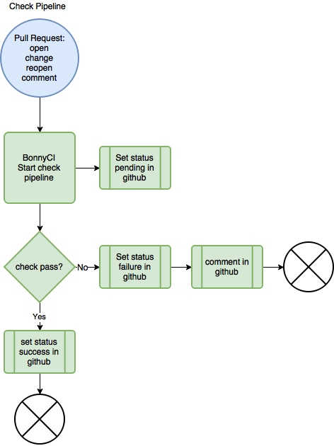
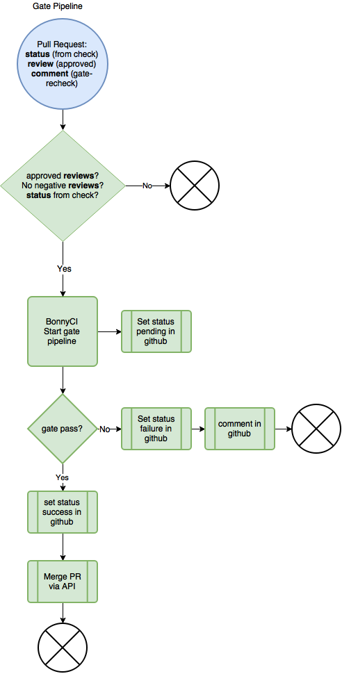

# Check and Gating Pipeline Management with Zuul and GitHub

## Problem Statement

The pipelines managed by Zuul are dependent upon events occurring in GitHub. Currently the pipelines can only be triggered through manual intervention and branch management requires a manual review of the pipeline results. Communication channels should be established between these two separate systems so that GitHub events automatically trigger the Zuul pipelines and appropriate branch management tasks are completed based on those results.

## Overview

A Continuous Integration Pipeline is the series of steps a proposed change in version control goes through as it passes through the CI system. BonnyCI uses Zuul to define and manage its CI pipelines, integrating with GitHub using Webhooks. For more information about Zuul and Github Webhooks, see the corresponding sections in this document.

BonnyCI defines two Pipelines, the Check Pipeline and the Gate Pipeline. The Check Pipeline is an Independent Pipeline that manages the testing of a single Github Pull Request. The Gating Pipeline is a Dependent Pipeline that tests a queue of changes and merges them upon successful completion.

This specification defines the state management between Github and the BonnyCI Check and Gate Pipelines. Zuul provides status updates to GitHub as the Pull Request travels through each pipeline and in some cases posts comment feedback once it reaches the end of a pipeline.

### Zuul

Zuul is a project gating system that grew out of the OpenStack community. While originally built to work with Gerrit, the BonnyCI project seeks to integrate Zuul with GitHub. For more information about Zuul, see the [Zuul Documentation](http://docs.openstack.org/infra/zuul/).

### GitHub Webhooks

The repository owner configures webhooks in their repository settings to subscribe an external service to specific types of events. When that type of event is triggered, GitHub sends an HTTP POST payload to the webhook's configured URL. For more information about configuring webhooks for BonnyCI see (insert link to resource here).

### GitHub Status

A GitHub Status is a set of metadata regarding a particular commit sha. This metadata is specific to a given Repository. A status object has a context (or label), a state, a target URL, and a description. A commit sha may have more than one status from more than one users. For more information about GitHub Statuses see the [GitHub developer docs](https://developer.github.com/v3/repos/statuses/)

## Check Pipeline

The Check Pipeline is the series of jobs that will occur when a Pull Request is submitted or updated. Zuul builds the Check Pipeline queue based on when Pull Requests are triggered and can test multiple pull requests in parallel. When a Pull Request passes the Check Pipeline, a status is posted to the GitHub repository indicating success.

The two integration points between GitHub and Zuul for the Check Pipeline are the initiation of the Check Pipeline and the completion of the Check Pipeline.

### Triggering the Check Pipeline

The BonnyCI Zuul server is subscribed to specific repository events through the webhook defined in the GitHub repository. The Zuul server initiates the Check Pipeline when it receives a GitHub event payload for the following events:

* A new pull request is created (`pr-open`)
* An existing pull request is modified (`pr-change`)
* A closed pull request is re-opened (`pr-reopen`)
* A comment is posted to an existing pull request with the text `recheck` (`pr-comment`)

Zuul posts a new status for the commit at the tip of the Pull Request via the GitHub API. Zuul sets the status state to `pending` and provides a context (label) that matches the name of the pipeline, such as `check_github`.

### Check Pipeline Results

Once the jobs in the Check Pipeline have completed, Zuul posts the following using the GitHub API:

1. a new status for the commit with a state of `success` or `failure`, depending on the outcome of the jobs, including a URL to the job logs

#### Fail

On failure, Zuul posts a commit status with the state of `failure`. Zuul also posts a Pull Request Comment stating the build failed, a list of links to logs from each stage of Pipeline, the status of each job in the Pipeline (FAILED or SUCCEEDED), and how long that job took to run.

Example:

`Build failed.`
`http://logs.bonnyci.com/check_github/BonnyCI/hoist/61/1484860623.13/ubuntu-hoist : FAILURE in 4m 15s`

## Gate Pipeline

The Gate Pipeline is the series of jobs that must occur prior to a Pull Request being merged. The Gate Pipeline is a queue of Pull Requests that can be tested together. Zuul builds the Gate Pipeline queue based on when Pull Requests are triggered and what jobs they share in the pipeline[1]. When a Pull Request passes the Gate Pipeline, it is automatically merged into the target branch. Therefore, the requirements for triggering the Gate Pipeline are more stringent than they are for the Check Pipeline.

### Triggering the Gate Pipeline

The Zuul server initiates the Gate Pipeline when it receives a GitHub event payload for the following events:

* a new Pull Request Review set to approve (`pull_request_review`)
* a new Pull Request Comment with the text `gate-recheck` (`pr-comment`)
* a new Pull Request tip Commit Status with a `success` state (`status`)

The Gate pipeline utilizes requirements that must be met before enqueuing the change. Zuul examines the state of the Pull Request to determine if it meets the following requirements:

* The latest status of the tip commit for the Check pipline context with a state of `success`, indicating the Pull Request has successfully completed the Check Pipeline
* At least one Pull Request Review set to `approve` from a user with write access to the repository
* Zero Pull Requests Reviews set to `request_changes` from any user with write access to the repository

Zuul posts a new status for the commit at the tip of the Pull Request via the GitHub API. Zuul sets the status state to `pending` and provides a context (label) that matches the name of the pipeline, such as `gate_github`.

### Gate Pipeline Results

Once the jobs in the Gate Pipeline have completed, Zuul posts the following using the GitHub API:

1. a new status for the commit with a state of `success` or `failure`, depending on the outcome of the jobs, including a URL to the job logs

#### Passing the Gate Pipeline

1. Zuul posts a new status for the commit set to `success`
2. Zuul merges the Pull Request by making a call to the GitHub API

#### Failing the Gate Pipeline

1. Zuul posts a new status for the commit set to `failure`
2. Zuul posts a new Pull Request comment indicating the merge failed, (with a link to the logs URL from the job(s) executions)
