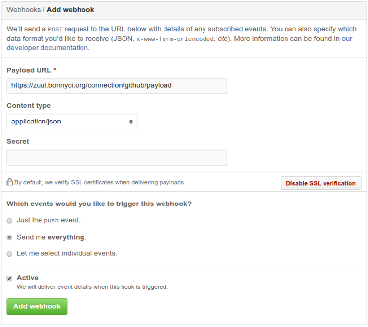
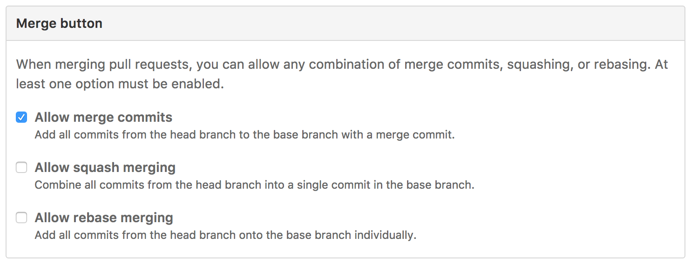

# Setup

## Table of Contents

* [Robots](#robots)
* [Webhook](#webhook)
* [Hoist Configuration](#hoist-configuration)
  * [Zuul Job Configuration](#zuul-job-configuration)
  * [Zuul Layout Configuration](#zuul-layour-configuration)
* [Merge Options](#merge-options)
  * [Setting the Correct Merge Option](#setting-the-correct-merge-option)

## Robots

The first step to getting BonnyCI into your repository is to give the robots team write access. This is so BonnyCI can automatically merge pull requests that pass all testing queues. Navigate to your repository's settings page, click on the `Collaborators & teams` section in the left-hand menu, and click `Add a team:` in the dropdown menu under the `Teams` section.

For more on organizations and teams, check out the [Github documentation](https://help.github.com/enterprise/2.8/admin/guides/user-management/organizations-and-teams/).

## Webhook

The next step to getting BonnyCI into your repository is to add the BonnyCI webhook. This is to notify BonnyCI of events taking place in your repository, such as newly opened pull requests. Navigate to your repository's settings page, click on the `Webhooks` section in the left-hand menu, and click the `Add webhook` button to the right. Paste the following link into the `Payload URL` item:

```webhook
http://zuul.bonnyci.org:8001/connection/github/payload
```

Ensure the `Content Type` dropdown is set to `application/json`, the `Send me everything.` radio button is selected, and the `Active` box is checked. Once this is done, click the green `Add webhook` button to finish. Here is a sample of what the settings will look like:



## Hoist Configuration

We'll need some configuration changes in [hoist](https://github.com/BonnyCI/hoist) for your project to gain the necessary Zuul testing queues. Follow our [contribution lore](https://github.com/BonnyCI/lore/tree/master/developers/contributing) for getting these files updated.

### Zuul Job Configuration

This file will add a definition for what tests to run on your repository with BonnyCI. Place it in `hoist/roles/zuul/files/jobs/repo_name.yaml`. Here is a sample configuration:

```YAML
- job:
    name: unique_job_name
    node: 'ubuntu-xenial'

    builders:
      - zuul-git-prep
      - shell: |
          #!/bin/bash -xe
          ./path/to/script/in/your/repo.sh

    publishers:
      - console-log
```

### Zuul Layout Configuration

Now that we have defined what tests will run on your project, we need to ensure that BonnyCI will actually run them. Edit `hoist/roles/zuul/templates/etc/zuul/config/layout.yaml` and add an entry in the `projects:` list for your project. Ensure it is in alphabetical order. Here is a sample configuration:

```YAML
projects:
  ...

  - name: unique_job_name
    check_github:
      - name_of_job_config_file
    gate_github:
      - name_of_job_config_file

  ...
```

## Merge Options

Repositories that use BonnyCI should not use any merge strategy which changes the SHA of the commit. This is because [zuul](https://github.com/openstack-infra/zuul), the scheduler used in BonnyCI, will be thrown off by the change in SHA if multiple changes are running in the gate. BonnyCI tests the changes in the pull requests without altering them. To ensure that which is tested is what is merged, do not enable a merge strategy that would alter the pull request content upon merging it.

GitHub presents repository owners with 3 choices for what happens when merging a pull request:

* Create a merge commit
* Squash and merge
* Rebase and merge

For more on these options and what they mean, read the [documentation on merge methods](https://help.github.com/articles/about-merge-methods-on-github/) provided by GitHub.

### Setting the Correct Merge Option

In order for BonnyCI to function correctly, please only allow merge commits. From your repository's home page, navigate to the `Settings` tab. Scroll down to the section labeled `Merge button`, and ensure that it matches the following:


