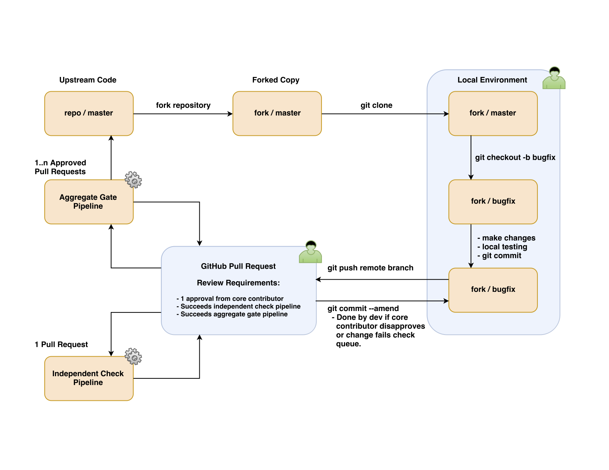

# Use

## Table of Contents

* [Automated Testing](#automated-testing)
* [Pull Request Lifecycle](#pull-request-lifecycle)
* [BonnyCI Workflow](#bonnyci-workflow)
* [Handling Merge Failures](#handling-merge-failures)

## Automated Testing

When a developer opens a pull request against a project, that pull request moves into the "check" queue. This functions similarly to other continuous integration solutions such as [Travis CI](https://travis-ci.com/) and [Jenkins](https://jenkins.io/). The check queue applies the code in the pull request to the existing codebase and tests it independently. This functionality is not new to GitHub users, but needed as a part of a full continuous integration solution.

If a pull request fails the check queue, then it will not be able to move on to further testing. The developer will make changes to the pull request until it passes the check queue. Concurrently, core contributors of the project will be reviewing pull requests. Core contributors confirm pull requests' technical value and guideline conformity.

Now we have a pull request that has core contributor approval and successful check queue results. That pull request will automatically move on to the "gate" queue. The gate queue collects all pull requests in this state and tests them together in their theoretical merge order. If any pull request in the gate queue fails, BonnyCI reports it on the pull request's conversation page. The pull requests that remain in the gate queue are re-tested together in their new theoretical merge order. This process repeats until no failures are present. Any pull requests which pass the gate queue are automatically merged. This ensures that what gets tested is what gets merged, and is new functionality to GitHub users.

## Pull Request Lifecycle

1. New pull request is opened against your repository.
2. BonnyCI places pull request on top of existing repository codebase and tested independent of any other open pull requests (the `github_check` zuul pipeline).
3. Contributors to the project review the pull request. If changes are requested, the pull request author will make them and amend the commit.
4. A Core contriubtor gives an `approved` review.
5. BonnyCI places all open pull requests with `approved` reviews on top of the existing repository codebase in the order they were approved (the `github_gate` zuul pipeline). If any pull request fails the testing, BonnyCI will kick that pull request out and test the remaining changes together. This testing process will recurse until the build passes.
6. Once the pull request passes both rounds of testing, BonnyCI will automatically merge the pull request to the repository's master branch.

## BonnyCI Workflow

This image illustrates the BonnyCI continuous integration pipeline.



## Handling Merge Failures

Anne-Bonny, the bot user which handles checking and gating pull requests, may
report back to a pull request informing the developer and reviewers that she
encountered a merge failure. This typically happens in the gate queue, and will
usually fall into one of the two categories detailed below.

### Stale Pull Requests

Occasionally, a pull request may fall by the wayside while other changes are
given a higher priority by reviewers. This can leave behind a pull request
which has become stale, meaning that the changes it is making are based off of
an older git history. In most cases, this can be resolved with a simple rebase:

```shell
  $ git fetch <upstream-remote>
  $ git rebase <upstream-remote>/master
  $ git push <your-remote>/<branch>
```

This will update the pull request's branch by taking its commit(s) off of the
branch's HEAD, updating the branch to the new compare branch's HEAD, and then
placing the pull request's commit(s) back on top. This usually results in a
branch that is n number of commits ahead of origin/master, where n is the
number of commits in your pull request (preferably one).

### Competing Pull Requests

What if the merge failure is a little more complicated?

It is possible that two or more pull requests will attempt to change the same
parts of a codebase, and one will merge prior to the other. This is a
natural occurence when communities collaborate on a project, and it results in
what is known in git as a merge conflict.

For information on how to resolve merge conflicts, refer to
[Resolving a merge conflict on the command line](https://help.github.com/articles/resolving-a-merge-conflict-using-the-command-line/).

**NOTE**: Repositories which require multiple continuous integration checks
(ex: a repository which has both BonnyCI and Travis CI) may encounter merge
failures from BonnyCI. This is a definite if branch protection settings for a
repository require that pull requests pass checks from CI systems other than
BonnyCI. For this reason, the use of other CI services which require passing
checks through branch protection alongside BonnyCI is discouraged.
